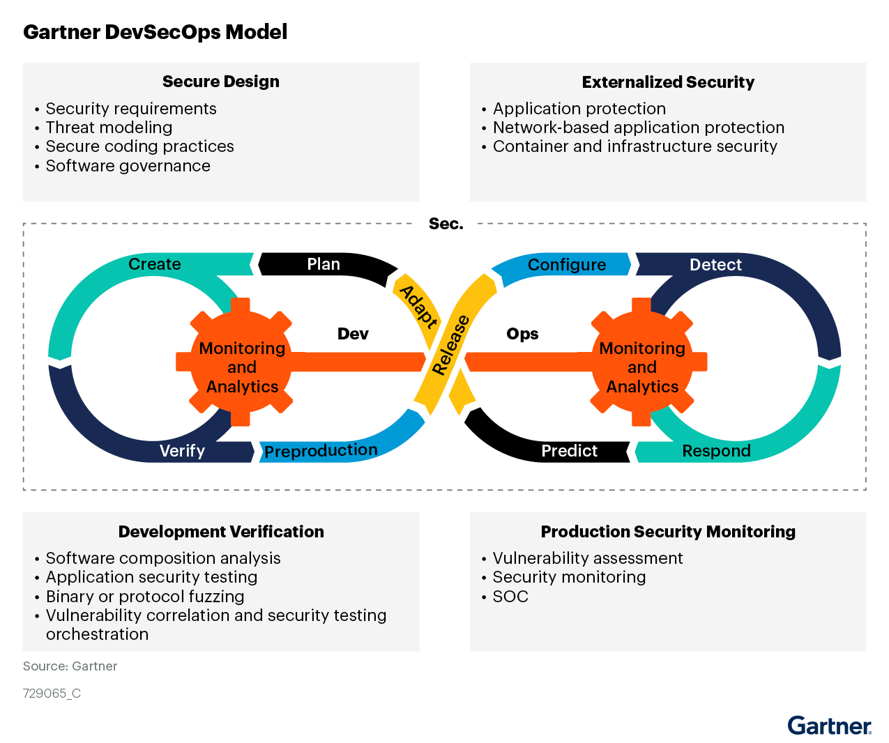
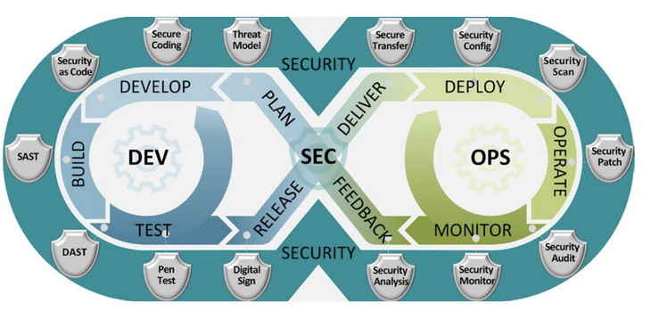

# DevSecOps-Vault
Collection of roadmaps, tools, best practice, resources about DevSecOps

# What is DevSecOps

DevSecOps is an approach to software development that integrates security into the entire software development lifecycle. It combines the principles of DevOps with security to create a culture of security that permeates the entire development process.

The goal of DevSecOps is to ensure that security is not an afterthought but is built into the development process from the very beginning. This approach emphasizes collaboration between development, operations, and security teams to ensure that security is a shared responsibility across the organization.

DevSecOps involves the implementation of security controls throughout the development lifecycle, from design to deployment, and beyond. This includes automated security testing, continuous monitoring, vulnerability assessments, and penetration testing.

By implementing DevSecOps practices, organizations can improve their overall security posture and reduce the risk of security breaches and vulnerabilities. This approach also helps to accelerate the delivery of secure software by integrating security into the development process, rather than treating it as a separate activity.

Take a look at links for detailed explanitation on DevSecOps:

* [Redhat definitions](https://www.redhat.com/en/topics/devops/what-is-devsecops)
* [IBM definitions](https://www.ibm.com/cloud/learn/devsecops)
* [Synk definitions](https://snyk.io/series/devsecops/)
* [Synopsys definitions](https://www.synopsys.com/glossary/what-is-devsecops.html)
* [Spacelift definitions](https://spacelift.io/blog/what-is-devsecops)

# TOOLS for DevSecOps

DevOps loop contains ==>  Plan, Code, Build, Test, Release, Deploy, Operate, Monitor.

## Pre-commit tools

DevSecOps pre-commit tools are a critical part of the software development lifecycle, particularly for organizations that prioritize security in their development processes. These tools help ensure that security considerations are integrated into every step of the development process, from coding to deployment.

Here are some reasons why DevSecOps pre-commit tools are important:

Early detection of security vulnerabilities: Pre-commit tools can identify security issues early in the development process, before code is even committed to the repository. This allows developers to address security concerns immediately, rather than discovering them later in the development process when they can be much more difficult and expensive to fix.

Consistent security standards: Pre-commit tools can enforce consistent security standards across the development team, ensuring that security best practices are followed by all developers.

Reduced risk of security breaches: By catching security issues early, pre-commit tools can help reduce the risk of security breaches and protect sensitive data.

Improved efficiency: Pre-commit tools can help developers catch security issues before they become more complex and time-consuming to fix, which can ultimately lead to more efficient development processes.

Enhanced collaboration: Pre-commit tools can help facilitate collaboration between developers and security teams by providing a common language and set of standards for discussing security issues.

Overall, DevSecOps pre-commit tools play a critical role in ensuring that security is integrated into the software development lifecycle. By catching security issues early and enforcing consistent standards, these tools help organizations build more secure and efficient software.

| Name | URL | Description | Meta | 
| :---------- | :---------- | :---------- | :----------: |
| **git-secrets** | [https://github.com/awslabs/git-secrets](https://github.com/awslabs/git-secrets) | AWS labs tool preventing you from committing secrets to a git repository  | |
| **git-hound** | [https://github.com/tillson/git-hound](https://github.com/tillson/git-hound) | Searchers secrets in git | | 
| **goSDL** | [https://github.com/slackhq/goSDL](https://github.com/slackhq/goSDL) |Security Development Lifecycle checklist   | |
| **ThreatPlaybook** | [https://github.com/we45/ThreatPlaybook](https://github.com/we45/ThreatPlaybook) |Threat modeling as code   | |
| **Threat Dragon** | [https://github.com/OWASP/threat-dragon](https://github.com/OWASP/threat-dragon) | OWASP Threat modeling tool  | |
| **threatspec** | [https://github.com/threatspec/threatspec](https://github.com/threatspec/threatspec) | Threat modeling as code  | |
| **pytm** | [https://github.com/izar/pytm](https://github.com/izar/pytm) | A Pythonic framework for threat modeling  | |
| **Threagile** | [https://github.com/Threagile/threagile](https://github.com/Threagile/threagile) | A Go framework for threat modeling  | |
| **MAL-lang** | [https://mal-lang.org/#what ](https://mal-lang.org/#what ) | A language to create cyber threat modeling systems for specific domains  | |
| **Microsoft Threat modeling tool** | [https://docs.microsoft.com/en-us/azure/security/develop/threat-modeling-tool](https://docs.microsoft.com/en-us/azure/security/develop/threat-modeling-tool) | Microsoft threat modeling tool  | |
| **Talisman** | [https://github.com/thoughtworks/talisman](https://github.com/thoughtworks/talisman) | A tool to detect and prevent secrets from getting checked in | |
| **SEDATED** | [https://github.com/OWASP/SEDATED](https://github.com/OWASP/SEDATED) | The SEDATED® Project (Sensitive Enterprise Data Analyzer To Eliminate Disclosure) focuses on preventing sensitive data such as user credentials and tokens from being pushed to Git. | |
| **Sonarlint** | [https://github.com/SonarSource/sonarlint-core](https://github.com/SonarSource/sonarlint-core) |  Sonar linting utility for IDE ||
| **DevSkim** | [https://github.com/microsoft/DevSkim](https://github.com/microsoft/DevSkim) |  DevSkim is a framework of IDE extensions and language analyzers that provide inline security analysis ||
| **detect-secrets** | [https://github.com/Yelp/detect-secrets](https://github.com/Yelp/detect-secrets) |  Detects secrets in your codebase || 
| **tflint** | [https://github.com/terraform-linters/tflint](https://github.com/terraform-linters/tflint) | A Pluggable Terraform Linter | |
